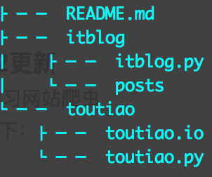

# 爬虫学习（以爬取开发者头条数据为例）

利用周末下午时间，做了一个爬取开发者头条数据的爬虫。

###主要思路：

- 数据源：开发者头条**`发现`**栏下面的主题数据：[http://toutiao.io/explore](http://toutiao.io/explore)

- 开发语言：Python2.7

- 用到的库：、urllib2、re、BeautifulSoup4

- 利用urllib2下载开发者头条网页内容，然后用BS4去解析网页里面的dom树。取出相应的数据。格式化输出到markdown。

- 目前只爬取了每个主题下面的第一页数据。

###遇到问题：

	Traceback (most recent call last):
	  File "toutiao.py", line 108, in <module>
	    obj_spider.craw(root_url)
	  File "toutiao.py", line 41, in craw
	    self.outputMarkdown(datas, page)
	  File "toutiao.py", line 97, in outputMarkdown
	    fout.write("##[%s](%s)\n" % (datas['subject'].encode('utf-8'), datas['url']))
	UnicodeDecodeError: 'ascii' codec can't decode byte 0xe7 in position 3: ordinal not in range(128)

###解决方式：

在脚本起始阶段加入以下代码：

	default_encoding = 'utf-8'
	if sys.getdefaultencoding() != default_encoding:
	    reload(sys)
	    sys.setdefaultencoding(default_encoding)

###2016-1-11更新
- 优化代码结构
- 可抓取全量数据
- 打印日志

###2016-1-12更新
- 新增IT博客大学习网站爬虫
- 调整目录结构如下：

